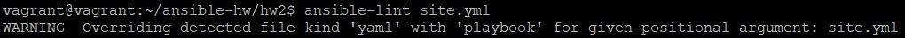
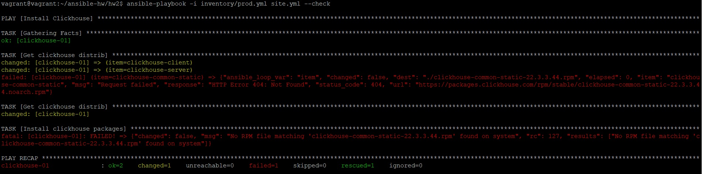
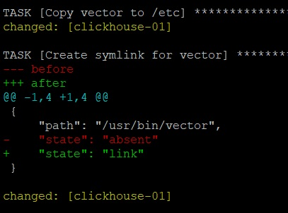
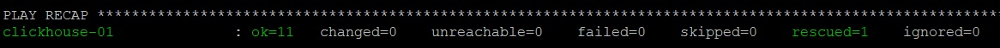

_[Ссылка](https://github.com/netology-code/mnt-homeworks/tree/MNT-13/08-ansible-02-playbook) на задание_

### Задача 5

1. Исправил ошибку в отсутствии названия у `block`
2. Указал полное название у всех коллекций
3. Добавил для нужных задач параметр с правами

---

### Задача 6

Запуск в check режиме не отработал, потому что дистрибутивы реально не скачались

---

### Задача 7

`ansible-playbook -i inventory/prod.yml site.yml --diff`  
Запуск в diff режиме отработал. Скачались архивы, создались файлы

---

### Задача 8

Повторный запуск playbook в diff режиме идемпотентен

---

### Задача 9

Play по установке vector
1. В `group_vars` есть переменная `vector_version`, в которой задается версия вектора, которую нужно установить
2. Плей выполняется на хостах группы `clickhouse`
3. На уровне плея есть `handler`, который перезапускает процесс `vector` через `systemctl` с перечитыванием измененных конфигурационных файлов
4. Первой `task` в плее идет скачивание архива `tar.gz` с выбранной версией vector в домашний каталог при помощи модуля `get_url`
5. Далее идет распаковка этого архива в домашнем каталоге на удаленном сервере при помощи `unarchive`
6. При помощи модуля `copy` на сервере производим копирование распакованного архива из домашнего каталога пользователя в каталог `/etc` под рутом
7. При помощи `file` создаем символическую ссылку на бинарник vector в `/usr/bin/`, чтобы он был доступен в PATH
8. Модуль `template` создает настроечный файл для vector по пути `/etc/vector-x86_64-unknown-linux-musl/config/config.yaml`. По факту, файл просто копируется. Переменных внутри нет  
   В настроечном файле vector используются:
   * source - `demo_logs` для генерации рандомных логов в json
   * transform - `dedupe` для удаления дублирующих строк
   * sink - `clickhouse` для записи данных на localhost в таблицу `test_table` базы `logs` в Clickhouse
9. При помощи `template` создается настроечный файл для управления vector через `systemctl`. Файл копируется из локальной директории `templates`. Данная `task` вызывает `handler` по запуску vector