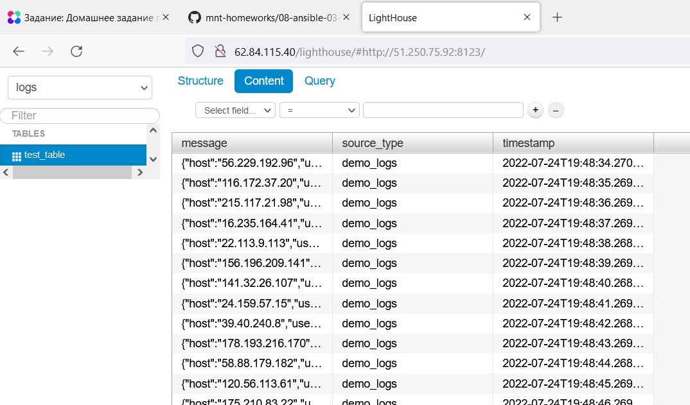
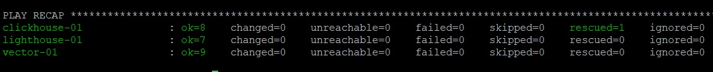

_[Ссылка](https://github.com/netology-code/mnt-homeworks/tree/MNT-13/08-ansible-03-yandex) на задание_

### Задача 7

`ansible-playbook -i inventory/prod.yml site.yml --diff`  
Запуск в diff режиме отработал. Изменения применились

---

### Задача 8

Повторный запуск playbook в diff режиме идемпотентен

---

### Задача 9

Play по добавлению данных в /etc/hosts
1. Плей выполняется на хостах групп `clickhouse`, `vector`, `lighthouse`
2. В единственной таске вызывается модуль `blockinfile`, который добавляет в /etc/host полученные ip хостов clickhouse-01, vector-01, lighthouse-01 для взаимодействия между ними.
3. В качестве маркера для контроля изменений используется строка `# {mark} ANSIBLE ADD HOSTS`
4. Плей содержит тег `always`, выполняется всегда, когда вызывается выполнение плейбука с каким-либо тегом.

Play по установке Clickhouse
1. В `group_vars` в группе `clickhouse` есть переменная `clickhouse_version` с версией clickhouse, которую нужно установить.
2. Также в переменнах группы есть список `clickhouse_packages` с названиями пакетов для скачки Clickhouse
3. Плей выполняется на хостах группы `clickhouse`
4. На уровне плея есть `handler`, который перезапускает процесс `clickhouse` через `systemctl` с перечитыванием измененных конфигурационных файлов
5. Первая `task` в плее - это блок, который скачивает с сайта `packages.clickhouse.com` rpm пакеты с именами из переменной `clickhouse_packages` для нужной версии при помощи модуля `get_url`
6. При возникновении ошибок, для блока вызывается `rescue`, который повторяет попытку скачивания rpm `clickhouse-common-static` с измененным от первой попытки суффиксом.
7. Следующая задача при помощи модуля `yum` устанавливает скачанные пакеты из под `root` и вызывает `handler` по перезапуску clickhouse
8. При помощи модуля `templates` на сервере создается настроечный файл clickhouse /etc/clickhouse-server/config.xml. Отличие от базового в том, что там задан `local_ip`, на котором биндится clickhouse-server
9. При помощи модуля `meta` принудительно вызываются `handler'
10. Модуль `command` вызывает утилиту `clickhouse-client` с командой по созданию базы данных `logs`. Результат выполнения команды записывается в переменную `create_db`
11. Задача считается `failed`, если код выполнения команды не равен успешному (0), либо означающему, что БД уже создана(82)
12. Задача считается `changed`, если код выполнения успешный (0)
13. Далее при помощи модуля `command` вызывается `clickhouse-client` для создания таблицы `test_table` в БД `logs` с тремя полями типа String (message, source_type, timestamp) и движком `Log`. Результат записывается в переменную `create_db`
14. Задача считается `failed`, если код выполнения команды не успешный (0), либо не означающий, что такая таблица уже существует (57).
15. Задача `changed`, когда код выполнения равен 0
16. Плей содержит тег `clickhouse` для возможности отдельного выполнения

Play по установке Vector
1. В `group_vars` в группе `vector` есть переменная `vector_version`, в которой задается версия вектора, которую нужно установить
2. Плей выполняется на хостах группы `vector`
3. На уровне плея есть `handler`, который перезапускает процесс `vector` через `systemctl` с перечитыванием измененных конфигурационных файлов
4. Первой `task` в плее идет скачивание архива `tar.gz` с выбранной версией vector в домашний каталог при помощи модуля `get_url`
5. Далее идет распаковка этого архива в домашнем каталоге на удаленном сервере при помощи `unarchive`
6. При помощи модуля `copy` на сервере производим копирование распакованного архива из домашнего каталога пользователя в каталог `/etc` под рутом
7. При помощи `file` создаем символическую ссылку на бинарник vector в `/usr/bin/`, чтобы он был доступен в PATH
8. Модуль `template` создает настроечный файл для vector по пути `/etc/vector-x86_64-unknown-linux-musl/config/config.yaml`. По факту, файл просто копируется. Переменных внутри нет  
   В настроечном файле vector используются:
   * source - `demo_logs` для генерации рандомных логов в json
   * transform - `dedupe` для удаления дублирующих строк
   * sink 
     - `clickhouse` для записи данных на сервер clickhouse в таблицу `test_table` базы `logs` в Clickhouse
     - `console` для вывода полученной информации в `stdout` в формате `json` (использовался для выясления, какие поля должны быть в таблице в clickhouse). 
9. При помощи `template` создается настроечный файл для управления vector через `systemctl`. Файл копируется из локальной директории `templates`. Данная `task` вызывает `handler` по запуску vector
10. Плей содержит тег `vector` для возможности отдельного выполнения

Play по установке Lighthouse
1. В `group_vars` в группе `lighthouse` не содержится никаких переменных
2. Плей выполняется на хостах группы `lighthouse`
3. На уровне плея есть `handler`, который перезапускает процесс `nginx` через `systemctl` с перечитыванием измененных конфигурационных файлов
4. Первая `task` в плее при помощи модуля `yum` устанавливает пакет `git`
5. Далее при помощи `git` в каталог `/etc/lighthouse` клонируется репозиторий lighthouse, ветка master
6. Снова вызывается модуль `yum`. При помощи `with_items` уставливаются пакеты `epel-release` и `nginx`. Вызывается `handler`
7. При помощи `templates` создается настроечный файл `/etc/nginx/conf.d/lighthouse.conf`, который по 80 порту и URI `/lighthouse` возвращает файл index.html из каталога с lighthouse
8. В последней таске также вызывается `handler`
9. Плей содержит тег `lighthouse` для возможности отдельного выполнения

